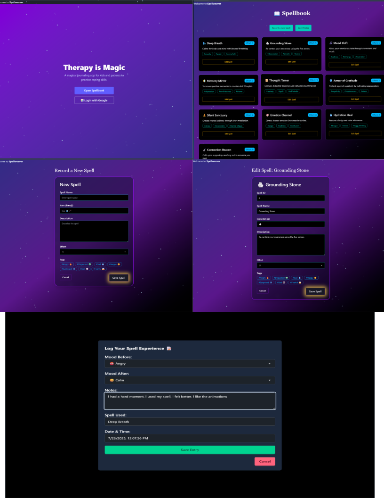

# Spellweaver - FrontEnd Demo

### Screenshots



### Demo Video
[🎥 Watch Demo Video](https://www.loom.com/share/43ee586df1ef43d8ac9518b307bf1619?sid=d32a6f25-d563-4e5d-acae-c69cec4ce53a)

## Install & Run Instructions

1. Clone or download the repository.  
2. Open a terminal and navigate to the project folder.  
3. Install dependencies (if not done already):  
   ```bash
   npm install

Run the development server:
```bash
npm run dev
```
Open your browser and go to http://localhost:5173 (or the port shown in your terminal).

## Journaling Tool Disguised as Magic and Sorcery
Spellweaver is a therapeutic journaling app designed to help users remember and practice coping skills through an engaging "magic" theme. It allows users to journal their personal use of coping skills and empowers therapists to monitor their patients' use of theraputic techniques and guide them in developing new ones as well as using "spells" they've already crafted.

## Intent
The core intent of this project is to provide a practical, user-friendly tool that helps patients apply what they learn in therapy to their everyday lives. Supporting therapists in their critical role of patient care is central to the social good this app aims to promote.

## Possible Add-on Features
- Geolocation and timestamp tagging to identify when and where coping skills (magic) are most effectively used, helping pinpoint areas of stress or breakthrough.

- Social login (Google, Facebook, Email) for easier user onboarding.

- Multimedia journal entries including photos and voice notes.

- Gamification features like XP, badges, and levels to increase engagement.

- Therapist dashboard with patient linking and spell approval workflows.

- Cloud storage for media and secure backend for persistent data.

## Contact & Contributions
Feel free to open issues or submit pull requests. Contributions and feedback are welcome!


